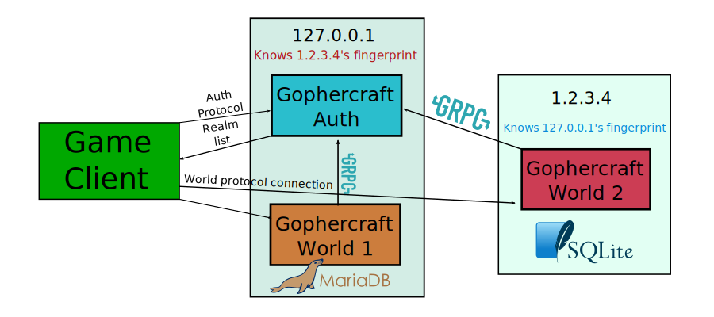

# Gophercraft

[](https://pkg.go.dev/github.com/superp00t/gophercraft)
[](https://www.gnu.org/licenses/gpl-3.0)
[](https://discord.gg/xPtuEjt)

The Gophercraft project provides 100% Go libraries and programs for research and experimentation with MMORPG software.

Gophercraft aims to target many different protocol versions through an all-in-one approach, instead of trying support every protocol version with its own Git branch.

At the moment it is functionally only a sandbox, but our hope is to extend its functionality further.

## What works so far in Gophercraft Core:

- Registration
- Authentication
- Server selection
- Creating characters
- Moving around in the world (3368, 5875, 8606)
- Authentication and realm list server
- Authentication protocol client
- Game server
- Basic client connection library
- HTTP JSON API for facilitating registration
- Support for Windows, Linux and Mac OS X
- Formatting/conversion tools written in pure Go
- Integrated mod manager

: Gophercraft is currently in development and **extremely** unstable: expect crashes, bugs, a general lack of features and a frequently changing API.

**⚠️ WARNING: Gophercraft is currently prone to all sorts of game-ruining exploits, and requires additional hardening before you use it for your own project.**

Don't hesitate to report errors or ask for clarification in the Discord!

# Deployment

This diagram shows an example configuration of Gophercraft:



## Server setup/installation

MariaDB Server is recommended for the best results.

```bash
# Install packages
sudo apt-get install git golang mariadb-server

# Install Gophercraft Core
go get -u -v github.com/superp00t/gophercraft/cmd/gcraft_wizard
go get -u -v github.com/superp00t/gophercraft/cmd/gcraft_core_auth
go get -u -v github.com/superp00t/gophercraft/cmd/gcraft_core_world

# Generate configuration files and create databases with the Gophercraft Wizard
gcraft_wizard

# You can edit your configurations in ~/.local/Gophercraft/Auth/Auth.txt
# and in ~/.local/Gophercraft/<worldserver folder>/World.txt
gcraft_core_auth

# launch worldserver
gcraft_core_world
```


